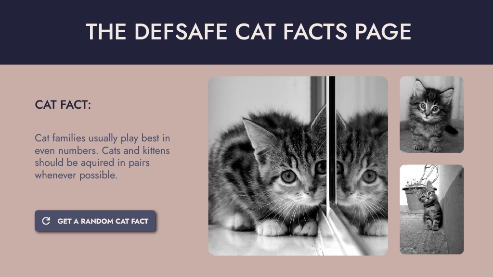

# The Cat Facts Test

You've been selected to create the website of the prestigious institution "The Defsafe Cat Facts". These are the requirements of the website:

## Web Page Design:

Note: The cat images on the design are placeholder images. You may use the images on the /images folder.

## Instructions:

The website functionality is simple and straightforward: A cat fact is displayed to the user. Whenever the user wants to see a new cat fact, they should click the blue button. This retrieves a new cat fact from a public API and refreshes the fact.

## Technologies to use:

- Nuxt.js 3 (you are free to use any modules you need.)
- Tailwind CSS
- Prisma
- Supabase

## Sources:

- API: [https://github.com/wh-iterabb-it/meowfacts](https://github.com/wh-iterabb-it/meowfacts)
- Color Palette: [https://coolors.co/palette/22223b-4a4e69-9a8c98-c9ada7-f2e9e4](https://coolors.co/palette/22223b-4a4e69-9a8c98-c9ada7-f2e9e4)
- Images are on the /images folder
- Font: Jost (Google Fonts)
- Icon: Material Symbols

## Test Scoring:

#### Points Table:

- 5 points: Delivering the test
- 5 points: Replicate the screen design using Tailwind
- 5 points: Correctly calling the API and returning/displaying the data
- 5 Points: Make the website responsive
- 5 Points: Make the API call from the server side using the /server folder
- 5 Points: Use Pinia as a state manager

#### Bonus Points (Optional but recommended, calculated as tiebreaker):

- +5 Points: Fetch many facts in only one API call and cache it so that all button clicks after the first one load from the cache.
- +3 Points: Deliver the solution including Unit Testing
- +3 Points: Add a fade out/in effect for each cat fact refresh

## Tips:

- Nuxt modules are your friends
- Pay close attention to visual details

## Submission Instructions:

To finalize and submit the solution, you must deploy the solution on Vercel and send us an email to the same address you received this test from, with the subject **_"Defsafe Application Test - [Your Full Name]"_** with the following content:

Live Website URL hosted on Vercel: **_[Insert URL here]_**

Github Link for the code repository: **_[Insert URL here]_**
